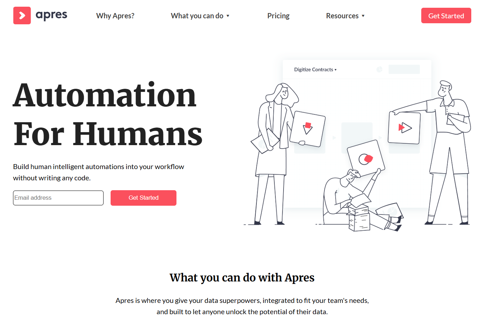
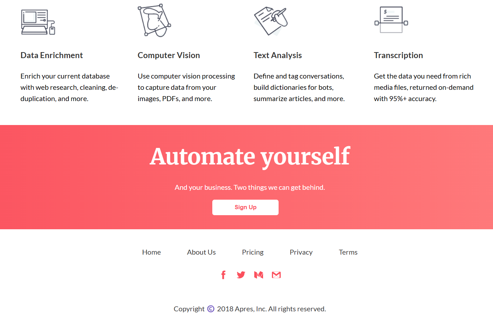

# Apres

This was our first page, it doesn't have links, buttons, and is not responsive yet. Because we focus on creating the structure of the page

This is the header of the page:

  

this is the footer of the page:

  

